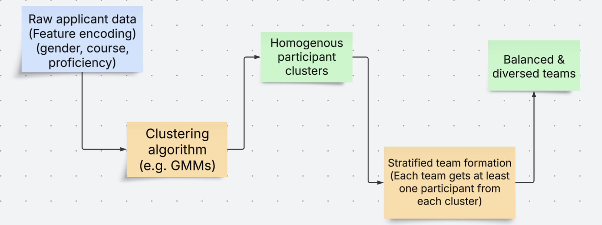

# GMM & Round Robin for Team Formations

## Introduction
This project is part of a larger project and attempts to find the best way to automatically pair participants of an event, competition e.g. hackathon within a web application. An overview of how it works is captured in the conceptual framework below.

